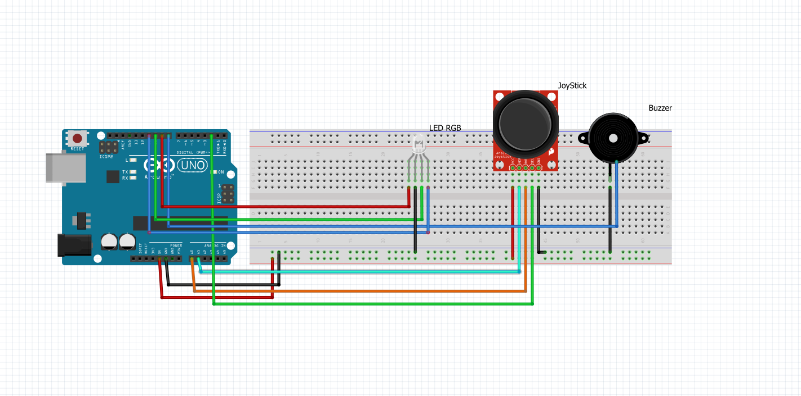

# 🧠 EmotionSenseAI: Sistema de Bem-Estar com IA Generativa

Este projeto foi desenvolvido para a Disciplina: **Arquiteturas Disruptivas: IoT, IoB & IA Generativa**

O objetivo é demonstrar uma solução que integra **Hardware (Arduino)**, **Node-RED** e **IA Generativa (Google Gemini)** para monitoramento e suporte ao bem-estar do usuário em tempo real.

---

## 1. 💻 Tecnologias Utilizadas

| Camada | Tecnologia | Propósito no Projeto |
| :--- | :--- | :--- |
| **Hardware** | Arduino UNO, Joystick, LED RGB, Buzzer | Coleta de dados físicos (humor) e feedback visual/sonoro. |
| **Ponte/Bridge** | Node-RED (Serial, Function, MQTT) | Transforma o dado Serial em JSON e publica no Broker. |
| **Mensageria** | MQTT (Broker: `broker.hivemq.com` ou `aedes`) | Transporte assíncrono e em tempo real dos dados. |
| **Backend** | Java 17, Spring Boot, Spring Integration (`@Async`) | Recebe a mensagem MQTT, orquestra a chamada de IA. |
| **IA Generativa** | Spring AI, Google Gemini (Generative Language API) | Geração dinâmica de conteúdo (dicas de bem-estar personalizadas). |

---

## 2. 🔌 Circuito e Esquemática

O protótipo utiliza o Joystick para coletar o humor e o LED/Buzzer para feedback imediato.



### Conexões Lógicas

| Pino Arduino | Pino do Joystick | Função |
| :--- | :--- | :--- |
| **A0 / A1** | HOR / VER | Eixos X e Y (Leitura do Humor) |
| **D2** | SEL (Switch) | Confirmação do Humor (Enviar Dica) |
| **D9, D10, D11** | - | LED RGB (Feedback Visual) |
| **D8** | - | Buzzer (Feedback Sonoro) |

---

## 3. 🚀 Como Executar o Fluxo Completo

### Parte 1: Preparação e Hardware

1.  **Arduino:** Carregue o código `totem_humor.ino` na sua placa.
2.  **Nuvem/API:** Obtenha suas chaves no site https://aistudio.google.com e ative a **Generative Language API** no Google Cloud.
3.  **Configuração Java:** No arquivo `humor-api/src/main/resources/application.properties`, configure:
    ```properties
    spring.ai.google.genai.project-id=SEU_PROJECT_ID_AQUI
    spring.ai.google.genai.api-key=SUA_CHAVE_API_AQUI
    mqtt.broker.url=tcp://broker.hivemq.com:1883
    mqtt.topic=fiap/gs/humor
    ```

### Parte 2: Ponte IoT (Node-RED)

1.  Execute o **Node-RED** no seu navegador (`http://localhost:1880`).
2.  Importe o `flow.json` e configure o nó **Serial In** para a porta COM correta e 9600 Baud Rate.
3.  Faça o **Deploy**.

### Parte 3: Execução e Demonstração Final

- Execute a classe principal `HumorApiApplication.java` na sua IDE.
- **Ação:** Mova o Joystick para um humor (ex: TRISTE) e **pressione o botão**.
- **Resultado no Console Java:** E a dica de IA será exibida.

---

## 📊 Detalhes Técnicos do Dashboard (Node-RED)

O dashboard (embora simples neste projeto) é configurado para exibir os seguintes dados:

| Componente | Dados Exibidos | Descrição |
| :--- | :--- | :--- |
| **Indicador de Status** | Texto e Cor do LED | Exibe o Humor atual (`ANSIOSO` em vermelho, `FELIZ` em verde, etc.). |
| **Dica de IA** | Texto gerado pelo Gemini | Exibe a mensagem de suporte em tempo real. |

---

## 👨‍💻 Integrantes do Grupo

- Thiago Henry Dias - Rm 5545222
- Nicolas Dobbeck Mendes - Rm 557605
- José Bezerra Bastos Net - Rm 557605
